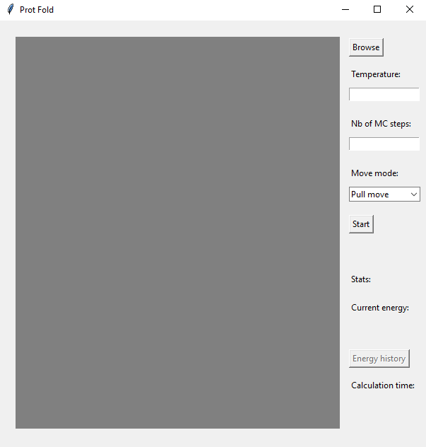
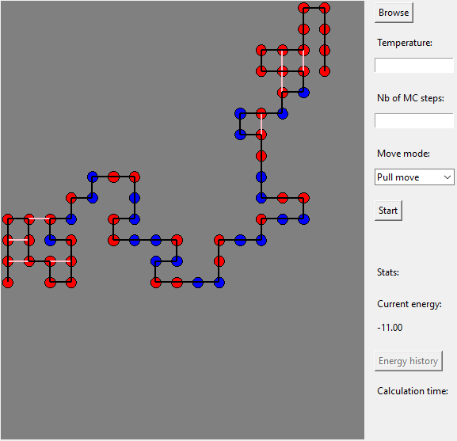
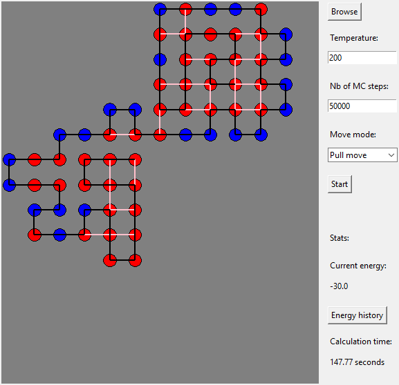
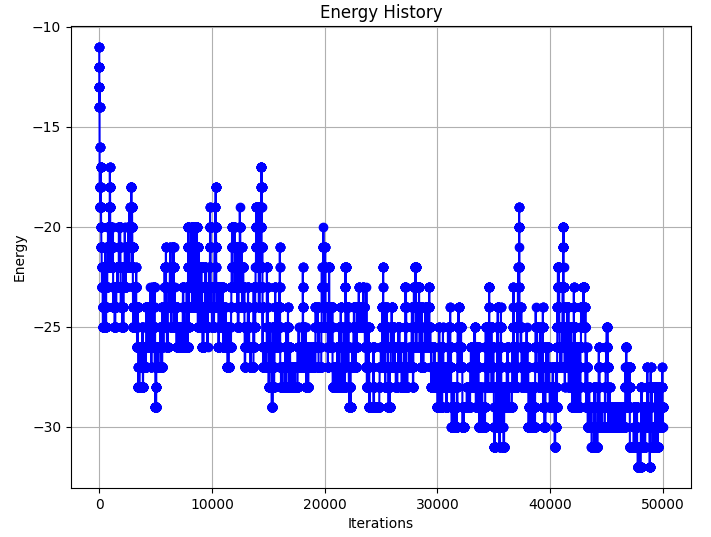

# Monte Carlo based 2D protein folding simulation

Prot Fold is a tool used to perform Monte Carlo simulation on 2D hydrophylic-hydrophobic (HP) model. It implmeents pull moves and VSHD moves that encompass end moves, corner moves and crankshaft moves. It seeks to find the optimal conformation of the protein with the smallest possible energy.

This program was done for a university project, based on the following paper :

> [Reference](https://bmcbioinformatics.biomedcentral.com/articles/10.1186/1471-2105-8-342#ref-CR50) :
C. Thachuk, A. Shmygelska, and H. H. Hoos, “A replica exchange Monte Carlo algorithm for protein folding in the HP model,” BMC Bioinformatics, vol. 8, no. 1, p. 342, Sep. 2007, doi: 10.1186/1471-2105-8-342.

## Setup your environment

Clone this repository:

```bash
https://github.com/AnisMerabet/Monte-Carlo-based-peptide-folding-simulation.git
```

Install [miniconda](https://docs.conda.io/en/latest/miniconda.html).

Create the `monte-carlo` conda environment:

```
conda env create -f dependencies.yml
```

Load the `monte-carlo` conda environment:

```
conda activate monte-carlo
```

## Run the program

```bash
python prot_fold.py
```

## Usage

After running `prot_fold.py` in python, a graphical user interface will be displayed as following.



Use the button `Browse` to nagivate and open a `.fasta` file containing one protein. The format of the fasta file should include `>` before the name of the sequence and amino acids should be written in one letter nomenclature.
Here is an example:

```
> name of the protein sequence
ARINLDMEQFHVKPSW
```

Once the fasta file is loaded, the protein sequence is processed to translate it according to HP model before being displayed in a randomly set conformation. Hydrophobic amino acids (A, I, L, M, F, V, P, G, W and C) will be displayed with red circles whereas hydrophilic amino acids (R, N, D, E, Q, H, K, S, and Y) will be displayed in blue circles.
A black lines  every two amino acid in the peptide sequence and pink lines connect represent hydrophobic interation between two hydrophobic amino acids. The number of these interactions defines the current energy of the conformation which is displayed in Stats section automatically after loading the file
The user should define the temperature which should be a positive float and sets the number of Monte Carlo steps for the simulation. Two possible moves modes are available, pull moves which is defined by default and VSHD moves.
Clic the button `Start` to run the simulation. Once finished. The energy of the new conformation and calculation time are displayed in the Stats section. The button `Energy history` allow to display a graph in a new window showing the evolution energy according to Monte Carlo steps.

## Example usage

In this example, the file `S1-8.fasta` located in `data` directory was loaded to the application



The current energy of the conformation is -11.
The temperature was set to 200, the number of Monte Carlo steps was set to 50000 and the move mode was let to default value (Pull move)



The new energy of the conformation is -30 and the calculation time was 147.77 seconds
By pushing the button `Energy history`, the evolution of energy according to Monte Carlo steps is displayed



## License

This project was put under MIT license.

## Contact

For any suggestions or bug reporting, please contact merabet9anis@gmail.com